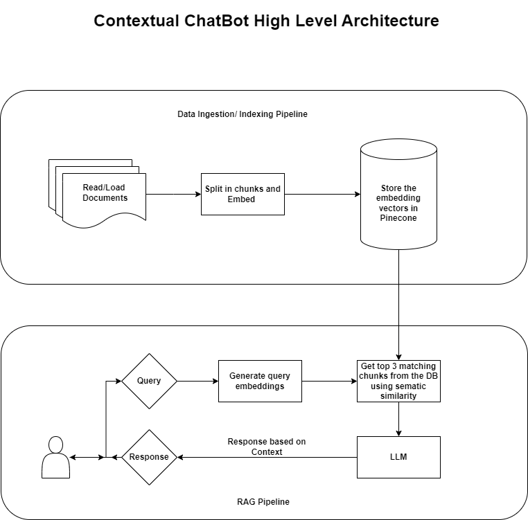
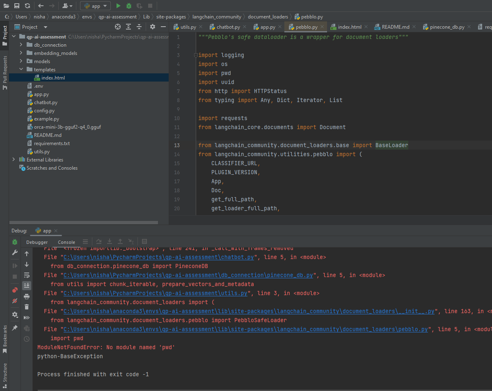
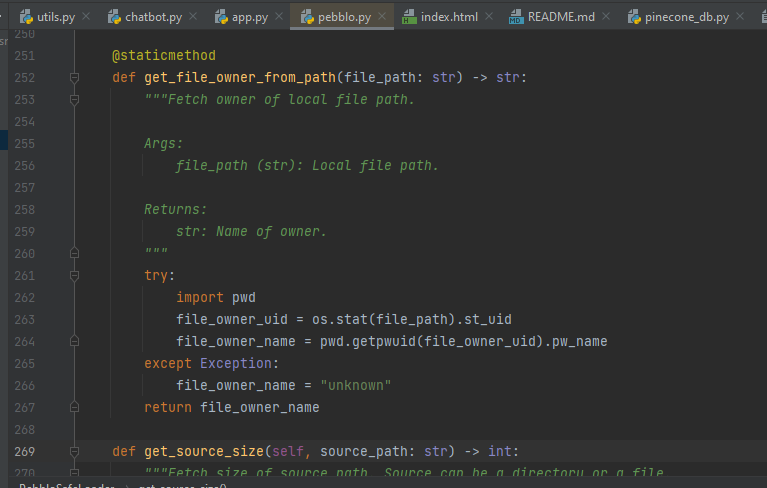

Problem Statement:
Contextual Chat Bot:

Mandatory Requirements:

Simple Contextual Chat Bot
1. Read a long PDF/ Word Document. 
2. Build a chat bot that will use the document as a context to answer the question. 
3. If the answer is not found in the document - it should say I don't know the answer. 

Advanced Challenge:
- Break down the document into multiple chunks/ paragraphs. 
- Store them in a vector database like pinecone.  
- When you ask a question find out the top 3 chunks that will likely have the answer to the question using semantic similarity search. 

This repo is the implementation of the given problem statement using a RAG system. 
## High-level architecture of the implementation

Two different LLM models have been used for the purpose of the implementation.
1. gpt-3.5-turbo
2. llama-2-7b-chat.ggmlv3.q4_1.bin (You need to download this model from the following [link](https://huggingface.co/TheBloke/Llama-2-7B-Chat-GGML/tree/main) 
and place it in the "llms" directory of this repo).

## Steps for running this repo:
1. Get OPENAI_API_KEY, PINECONE_API_KEY and HUGGINGFACEHUB_API_TOKEN from respective websites and paste it in .env file.**Note-In order to do inferencing through "gpt-3.5-turbo" it is expected that there must be some balance in you OpenAI account as 
it is a paid service. You can add some minimal amount of money as it costs very less amount of money for this model.**
2. Create virtual environment. 
3. Install requirements using
``pip install -r requirements.txt``
4. After installing everything from the requirements you also need to install below lib
``pip install unstructured[local-inference]``
5. In you are running this repo on windows 10, then you might encounter following error 

In order to resolve this error, in pebblo.py shift the "import pwd" to line no. 262 inside try block.

Now run flask app using command ``python -m flask run``

It is recommended to use **gpt-3.5-turbo** model as it is giving correct results while inferencing. 
The case with **llama-2-7b** is however not the same as it sometimes doesn't output the correct results. And 
also it was noticed that it is not following the instructions properly. 
The purpose of using the llama-2-7b was to run this locally of my PC and as per my PC's configuration this 
4-bit-quantised model was the best fit in terms of max RAM usage.

## Next Steps
As per the requirements all the points have been implemented and one can test it from their end. Now for the next steps
here are few points that can be implemented:
1. Build a RAG evaluation pipeline
2. Implement RAG pipeline with other open-source LLMs like(llama-2-13B, Mistral 7B, falcon)
3. Fine tuning LLM model

